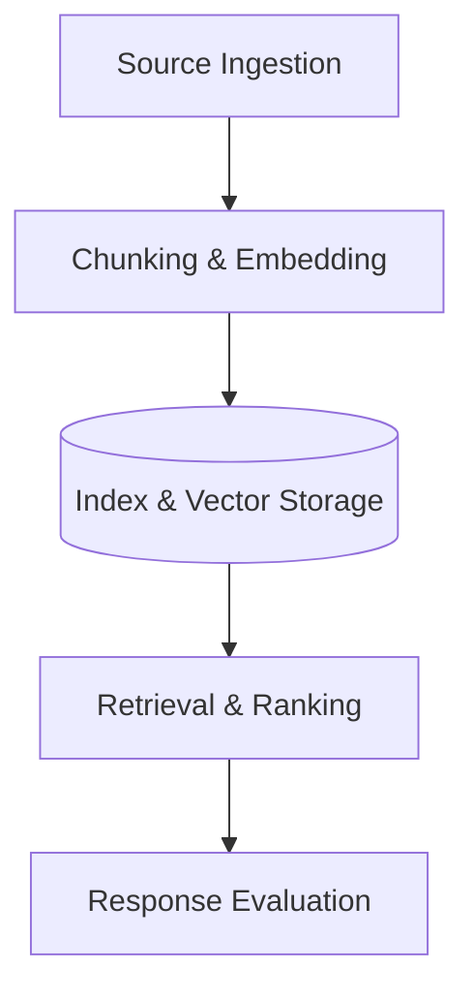

# Atlas


**A reference architecture for RAG (Retrieval-Augmented Generation) that makes it easy to see exactly why your AI answered the way it did, step-by-step.**

## Observable RAG Reference Architecture

A practical reference for retrieval systems that must be measurable, maintainable, and cost-aware.

**What is RAG?** RAG stands for Retrieval-Augmented Generation. It's the process of giving an AI model context from your private data (like documents or databases) so it can answer questions accurately instead of guessing.

## When to use this

Use this when you are building an AI app that searches your data, and you are struggling with the AI saying "I don't know" or giving bad answers, and you can't figure out *why*. Instead of a black box, Atlas helps you see exactly which step failed: Did it miss the document? Did it score it too low? Did the AI ignore it?

## Why This Exists

Retrieval systems usually fail at the operational layer, not the demo layer. Quality drops become hard to diagnose when ingestion, indexing, scoring, and response assembly are treated as a single black box.

Atlas separates those concerns so teams can inspect behavior, compare strategies, and improve quality without rewriting the entire system. The goal is not novelty. The goal is a retrieval stack that can be operated with confidence.

Atlas is built for resourceful teams that need clear retrieval architecture without building a large internal platform. The structure reflects delivery work where observability and cost control matter as much as answer quality.

## Core Principles

- Keep ingestion deterministic.
- Make retrieval scoring inspectable.
- Measure quality continuously.
- Isolate layers so iteration stays controlled.
- Optimize for operational clarity and cost discipline.

## Architecture Overview

Atlas defines five layers. Think of this like a physical library:

1. **Source Ingestion** (Acquiring new books)
2. **Chunking & Embedding** (Reading and summarizing chapters)
3. **Index & Storage** (The card catalog system)
4. **Retrieval & Ranking** (Finding the best books for a patron's question)
5. **Response Evaluation** (The librarian ensuring the chosen books actually answer the patron's question)

Each layer emits logs and metrics so failures can be traced to a specific decision point.



## Quickstart

```bash
pnpm install
pnpm dev      # start the docs site
pnpm build    # production build
pnpm check    # type-check
pnpm test     # run tests
pnpm verify   # check + build
```

> **Note:** The ingestion pipeline and retrieval scripts require a running PostgreSQL instance with the `pgvector` extension. The store module probes for `pgvector` at startup and exits with a descriptive error if unavailable. All other modules (chunker, ranker, evaluator) work without a database.

## Usage

```typescript
import { ingestDocument } from "./src/pipeline/ingest.js";
import { chunkDocument } from "./src/pipeline/chunk.js";
import { MockEmbeddingAdapter } from "./src/pipeline/embed.js";
import { rankCandidates } from "./src/retrieval/rank.js";
import { buildTrace } from "./src/retrieval/trace.js";

// 1. Ingest and chunk a document
const doc = await ingestDocument("path/to/doc.md");
const chunks = chunkDocument(doc, { chunkSize: 512, overlap: 64 });

// 2. Embed chunks
const adapter = new MockEmbeddingAdapter();
const vectors = await adapter.embed(chunks.map((c) => c.text));

// 3. Rank retrieval candidates
const ranked = rankCandidates(candidates, { topK: 5 });

// 4. Build a retrieval trace for observability
const trace = buildTrace(query, ranked, { totalLatencyMs: 42, embeddingLatencyMs: 12 });
```

Run the evaluation script against the bundled corpus:

```bash
node --experimental-strip-types src/eval/run.ts
# → { recallAt5: 0.8, mrr: 0.72, queryCount: 5 }
```

## Features

| Feature | Status |
|---|---|
| Docs site (Astro) | Available |
| Ingestion pipeline (`src/pipeline/ingest.ts`) | Available |
| Configurable chunker (`src/pipeline/chunk.ts`) | Available |
| Embedding adapter interface + mock (`src/pipeline/embed.ts`) | Available |
| pgvector store integration (`src/pipeline/store.ts`) | Available |
| Top-k semantic retrieval (`src/retrieval/query.ts`) | Available |
| Retrieval trace builder (`src/retrieval/trace.ts`) | Available |
| Score combiner / ranker (`src/retrieval/rank.ts`) | Available |
| Evaluation script with recall@5 + MRR (`src/eval/run.ts`) | Available |
| Sample corpus — 5 markdown documents (`src/corpus/`) | Available |
| Sample evaluation set — 5 query/answer pairs (`src/eval-set/pairs.ts`) | Available |
| pgvector availability probe at startup | Available |

## Tech Stack

- TypeScript
- Astro (docs site)
- TailwindCSS with CSS variables
- PostgreSQL + pgvector `[planned]`
- Edge-friendly assumptions

## Works With

| Repo | Integration |
|---|---|
| [protocol](../protocol) | Atlas retrieval results are validated against structured output contracts defined in Protocol |
| [foundation](../foundation) | Foundation's AI panel queries Atlas for knowledge-base Q&A examples |
| [blueprint](../blueprint) | Blueprint definitions can reference Atlas as the retrieval layer in generated scaffolds |
| [dblxl-demo](../dblxl-demo) | The demo portal surfaces Atlas's RAG pipeline in the knowledge-base Q&A cross-repo example |

## Roadmap

See [ROADMAP.md](./ROADMAP.md).

## Attribution

Published by DoubleXL
https://www.double-xl.com
